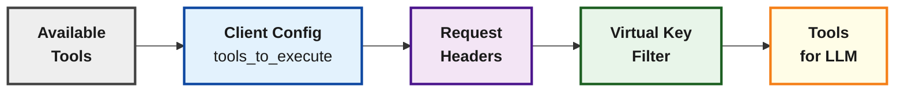

# Tool Filtering

> Control which MCP tools are available at the client, request, and virtual key levels.

## Overview

Bifrost provides **three levels of tool filtering** to control which MCP tools are available:

1. **Client Configuration** - Set which tools a client can execute (`tools_to_execute`)
2. **Request Headers** - Filter tools per-request via HTTP headers or context
3. **Virtual Key Configuration** - Control tools per-VK (Gateway only)

These levels stack: a tool must pass all applicable filters to be available.



***

## Level 1: Client Configuration

The `tools_to_execute` field on each MCP client config defines the **baseline** of available tools.

### Semantics

| Value                | Behavior                                 |
| -------------------- | ---------------------------------------- |
| `["*"]`              | All tools from this client are available |
| `[]` or omitted      | No tools available (deny-by-default)     |
| `["tool1", "tool2"]` | Only specified tools are available       |

### Configuration

<Tabs>
  <Tab title="Gateway">
    ```bash  theme={null}
    curl -X POST http://localhost:8080/api/mcp/client \
      -H "Content-Type: application/json" \
      -d '{
        "name": "filesystem",
        "connection_type": "stdio",
        "stdio_config": {
          "command": "npx",
          "args": ["-y", "@anthropic/mcp-filesystem"]
        },
        "tools_to_execute": ["read_file", "list_directory"]
      }'
    ```
  </Tab>

  <Tab title="Go SDK">
    ```go  theme={null}
    mcpConfig := &schemas.MCPConfig{
        ClientConfigs: []schemas.MCPClientConfig{
            {
                Name:           "filesystem",
                ConnectionType: schemas.MCPConnectionTypeSTDIO,
                StdioConfig: &schemas.MCPStdioConfig{
                    Command: "npx",
                    Args:    []string{"-y", "@anthropic/mcp-filesystem"},
                },
                ToolsToExecute: []string{"read_file", "list_directory"}, // Only these tools
            },
        },
    }
    ```
  </Tab>

  <Tab title="config.json">
    ```json  theme={null}
    {
      "mcp": {
        "client_configs": [
          {
            "name": "filesystem",
            "connection_type": "stdio",
            "stdio_config": {
              "command": "npx",
              "args": ["-y", "@anthropic/mcp-filesystem"]
            },
            "tools_to_execute": ["read_file", "list_directory"]
          }
        ]
      }
    }
    ```
  </Tab>
</Tabs>

***

## Level 2: Request-Level Filtering

Filter tools dynamically on a per-request basis using headers (Gateway) or context values (SDK).

### Available Filters

| Filter                | Purpose                                                      |
| --------------------- | ------------------------------------------------------------ |
| `mcp-include-clients` | Only include tools from specified clients                    |
| `mcp-include-tools`   | Only include specified tools (format: `clientName/toolName`) |

### Gateway Headers

```bash  theme={null}
# Include only specific clients
curl -X POST http://localhost:8080/v1/chat/completions \
  -H "x-bf-mcp-include-clients: filesystem,web_search" \
  -d '...'

# Include only specific tools
curl -X POST http://localhost:8080/v1/chat/completions \
  -H "x-bf-mcp-include-tools: filesystem/read_file,web_search/search" \
  -d '...'

# Include all tools from one client, specific tools from another
curl -X POST http://localhost:8080/v1/chat/completions \
  -H "x-bf-mcp-include-tools: filesystem/*,web_search/search" \
  -d '...'
```

### Go SDK Context Values

```go  theme={null}
// Include only specific clients
ctx := context.WithValue(context.Background(),
    schemas.BifrostContextKey("mcp-include-clients"),
    []string{"filesystem", "web_search"})

// Include only specific tools
ctx = context.WithValue(ctx,
    schemas.BifrostContextKey("mcp-include-tools"),
    []string{"filesystem/read_file", "web_search/search"})

// Wildcard for all tools from a client
ctx = context.WithValue(ctx,
    schemas.BifrostContextKey("mcp-include-tools"),
    []string{"filesystem/*", "web_search/search"})

response, err := client.ChatCompletionRequest(ctx, request)
```

### Wildcard Support

| Pattern                           | Meaning                            |
| --------------------------------- | ---------------------------------- |
| `*` (in include-clients)          | Include all clients                |
| `clientName/*` (in include-tools) | Include all tools from that client |
| `clientName/toolName`             | Include specific tool              |

***

## Level 3: Virtual Key Filtering (Gateway Only)

Virtual Keys can have their own MCP tool access configuration, which **takes precedence** over request-level headers.

<Note>
  When a Virtual Key has MCP configurations, it generates the `x-bf-mcp-include-tools` header automatically, overriding any manually sent header.
</Note>

### Configuration

<Tabs>
  <Tab title="Web UI">
    1. Navigate to **Virtual Keys** in the governance section
    2. Create or edit a Virtual Key
    3. In **MCP Client Configurations**, add the clients and tools this VK can access

    <Frame>
      
    </Frame>
  </Tab>

  <Tab title="API">
    ```bash  theme={null}
    curl -X POST http://localhost:8080/api/governance/virtual-keys \
      -H "Content-Type: application/json" \
      -d '{
        "name": "support-team-key",
        "mcp_configs": [
          {
            "mcp_client_name": "knowledge_base",
            "tools_to_execute": ["search", "get_article"]
          },
          {
            "mcp_client_name": "ticketing",
            "tools_to_execute": ["*"]
          }
        ]
      }'
    ```
  </Tab>

  <Tab title="config.json">
    ```json  theme={null}
    {
      "governance": {
        "virtual_keys": [
          {
            "name": "support-team-key",
            "mcp_configs": [
              {
                "mcp_client_name": "knowledge_base",
                "tools_to_execute": ["search", "get_article"]
              },
              {
                "mcp_client_name": "ticketing",
                "tools_to_execute": ["*"]
              }
            ]
          }
        ]
      }
    }
    ```
  </Tab>
</Tabs>

### Virtual Key MCP Config Semantics

| Configuration                  | Result                             |
| ------------------------------ | ---------------------------------- |
| `tools_to_execute: ["*"]`      | All tools from this client         |
| `tools_to_execute: []`         | No tools from this client          |
| `tools_to_execute: ["a", "b"]` | Only specified tools               |
| Client not configured          | All tools blocked from that client |

Learn more in [MCP Tool Filtering for Virtual Keys](../features/governance/mcp-tools).

***

## Filtering Logic

### How Filters Combine

1. **Client config** is the baseline (must include the tool)
2. **Request filters** further narrow down (if specified)
3. **VK filters** override request filters (if VK has MCP configs)

### Example Scenario

**Setup:**

* Client `filesystem` has `tools_to_execute: ["read_file", "write_file", "delete_file"]`
* Virtual Key `prod-key` has `mcp_configs: [{ mcp_client_name: "filesystem", tools_to_execute: ["read_file"] }]`

**Request with `prod-key`:**

```bash  theme={null}
curl -X POST http://localhost:8080/v1/chat/completions \
  -H "Authorization: Bearer vk_prod_key" \
  -H "x-bf-mcp-include-tools: filesystem/write_file" \  # This is IGNORED
  -d '...'
```

**Result:** Only `read_file` is available (VK config overrides request header)

**Request without VK (if allowed):**

```bash  theme={null}
curl -X POST http://localhost:8080/v1/chat/completions \
  -H "x-bf-mcp-include-tools: filesystem/write_file" \
  -d '...'
```

**Result:** Only `write_file` is available (request header applies)

***

## Common Patterns

### Read-Only Access

Allow only read operations:

```json  theme={null}
{
  "tools_to_execute": ["read_file", "list_directory", "get_file_info"]
}
```

### Environment-Based Filtering

Use different VKs for different environments:

```json  theme={null}
{
  "virtual_keys": [
    {
      "name": "development",
      "mcp_configs": [
        { "mcp_client_name": "filesystem", "tools_to_execute": ["*"] },
        { "mcp_client_name": "database", "tools_to_execute": ["*"] }
      ]
    },
    {
      "name": "production",
      "mcp_configs": [
        { "mcp_client_name": "filesystem", "tools_to_execute": ["read_file"] },
        { "mcp_client_name": "database", "tools_to_execute": ["query"] }
      ]
    }
  ]
}
```

### Per-User Tool Access

Create VKs for different user roles:

```json  theme={null}
{
  "virtual_keys": [
    {
      "name": "viewer-role",
      "mcp_configs": [
        { "mcp_client_name": "documents", "tools_to_execute": ["view", "search"] }
      ]
    },
    {
      "name": "editor-role",
      "mcp_configs": [
        { "mcp_client_name": "documents", "tools_to_execute": ["view", "search", "edit", "create"] }
      ]
    },
    {
      "name": "admin-role",
      "mcp_configs": [
        { "mcp_client_name": "documents", "tools_to_execute": ["*"] }
      ]
    }
  ]
}
```

***

## Advanced: Context-Based Filtering

For SDK users, filtering can be applied at the context level, enabling per-request tool customization:

### Go SDK Context Filtering

```go  theme={null}
import (
    "context"
    "github.com/maximhq/bifrost/core/schemas"
)

// Filter to specific clients
ctx := context.WithValue(
    context.Background(),
    schemas.BifrostContextKey("mcp-include-clients"),
    []string{"filesystem", "web_search"},
)

// Or filter to specific tools
ctx = context.WithValue(
    ctx,
    schemas.BifrostContextKey("mcp-include-tools"),
    []string{"filesystem/read_file", "web_search/search"},
)

// Request will only see filtered tools
response, _ := client.ChatCompletionRequest(ctx, request)
```

### Filter Precedence

When multiple filters apply, they combine as an intersection (AND logic):

```
Client Config Tools ∩ Request Filters ∩ VK Filters = Available Tools
```

**Example:**

* Client config allows: \[read\_file, write\_file, delete\_file]
* Request header specifies: \[read\_file, write\_file]
* VK config restricts to: \[read\_file]
* **Result:** Only \[read\_file] available

***

## Debugging Tool Availability

### Check Available Tools

**Gateway API:**

```bash  theme={null}
curl http://localhost:8080/api/mcp/clients
```

**Response shows tools per client:**

```json  theme={null}
[
  {
    "config": { "name": "filesystem", "tools_to_execute": ["read_file", "write_file"] },
    "tools": [
      { "name": "read_file", "description": "Read file contents" },
      { "name": "write_file", "description": "Write to file" }
    ],
    "state": "connected"
  }
]
```

### Check What LLM Receives

The tools included in a chat request depend on all active filters. To see what tools are available for a specific request, check the request body sent to the LLM provider in your logs or observability platform.

***

## Next Steps

<CardGroup cols={2}>
  <Card title="Virtual Key MCP Tools" icon="key" href="../features/governance/mcp-tools">
    Detailed VK tool configuration
  </Card>

  <Card title="Agent Mode" icon="robot" href="./agent-mode">
    Configure auto-execution for filtered tools
  </Card>
</CardGroup>


---

> To find navigation and other pages in this documentation, fetch the llms.txt file at: https://docs.getbifrost.ai/llms.txt