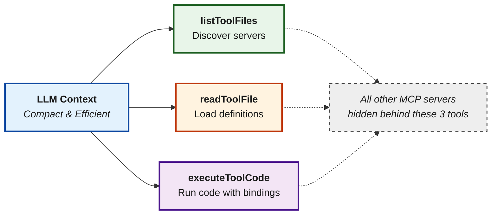

# Code Mode

> AI writes TypeScript to orchestrate tools. Reduces token usage by 50%+ when using multiple MCP servers.

<Note>
  This feature is only available on `v1.4.0-prerelease1` and above.
</Note>

## Overview

**Code Mode** is a transformative approach to using MCP that solves a critical problem at scale:

> **The Problem:** When you connect 8-10 MCP servers (150+ tools), every single request includes all tool definitions in the context. The LLM spends most of its budget reading tool catalogs instead of doing actual work.

**The Solution:** Instead of exposing 150 tools directly, Code Mode exposes just **three generic tools**. The LLM uses those three tools to write TypeScript code that orchestrates everything else in a sandbox.

### The Impact

Compare a workflow across 5 MCP servers with \~100 tools:

**Classic MCP Flow:**

* 6 LLM turns
* 100 tools in context **every turn** (600 tool-definition tokens)
* All intermediate results flow through the model

**Code Mode Flow:**

* 3-4 LLM turns
* Only 3 tools + definitions on-demand
* Intermediate results processed in sandbox

**Result: \~50% cost reduction + 30-40% faster execution**

Code Mode provides three meta-tools to the AI:

1. **`listToolFiles`** - Discover available MCP servers
2. **`readToolFile`** - Load TypeScript definitions on-demand
3. **`executeToolCode`** - Execute TypeScript code with full tool bindings

## When to Use Code Mode

**Enable Code Mode if you have:**

* ✅ 3+ MCP servers connected
* ✅ Complex multi-step workflows
* ✅ Concerned about token costs or latency
* ✅ Tools that need to interact with each other

**Keep Classic MCP if you have:**

* ✅ Only 1-2 small MCP servers
* ✅ Simple, direct tool calls
* ✅ Very latency-sensitive use cases (though Code Mode is usually faster)

**You can mix both:** Enable Code Mode for "heavy" servers (web, documents, databases) and keep small utilities as direct tools.

***

## How Code Mode Works

### The Three Tools

Instead of seeing 150+ tool definitions, the model sees three generic tools:



### The Execution Flow

```mermaid  theme={null}
graph LR
    User["<b>1. User Request</b><br/>Search YouTube<br/>& save to file"]

    Discover["<b>2. Discover Tools</b><br/>listToolFiles()"]

    GetDefs["<b>3. Load Definitions</b><br/>readToolFile()"]

    Write["<b>4. Write Code</b><br/>TypeScript<br/>in sandbox"]

    Execute["<b>5. Execute</b><br/>Real MCP calls<br/>contained in VM"]

    Result["<b>6. Compact Result</b><br/>{saved:10}"]

    Response["<b>7. Final Response</b><br/>Found & saved<br/>10 videos"]

    User --> Discover
    Discover --> GetDefs
    GetDefs --> Write
    Write --> Execute
    Execute --> Result
    Result --> Response

    style User fill:#E3F2FD,stroke:#0D47A1,stroke-width:2.5px,color:#1A1A1A
    style Discover fill:#F3E5F5,stroke:#4A148C,stroke-width:2.5px,color:#1A1A1A
    style GetDefs fill:#F3E5F5,stroke:#4A148C,stroke-width:2.5px,color:#1A1A1A
    style Write fill:#FFF3E0,stroke:#BF360C,stroke-width:2.5px,color:#1A1A1A
    style Execute fill:#E8F5E9,stroke:#1B5E20,stroke-width:3px,color:#1A1A1A
    style Result fill:#FFFDE7,stroke:#F57F17,stroke-width:2.5px,color:#1A1A1A
    style Response fill:#E8F5E9,stroke:#1B5E20,stroke-width:2.5px,color:#1A1A1A
```



**Key insight:** All the complex orchestration happens inside the sandbox. The LLM only receives the final, compact result—not every intermediate step.

***

## Why This Matters at Scale

### Classic MCP with 5 servers (100 tools):

```
Turn 1: Prompt + search query + [100 tool definitions]
Turn 2: Prompt + search result + [100 tool definitions]
Turn 3: Prompt + channel list + [100 tool definitions]
Turn 4: Prompt + video list + [100 tool definitions]
Turn 5: Prompt + summaries + [100 tool definitions]
Turn 6: Prompt + doc result + [100 tool definitions]

Total: 6 LLM calls, ~600+ tokens in tool definitions alone
```

### Code Mode with same 5 servers:

```
Turn 1: Prompt + 3 tools (listToolFiles, readToolFile, executeToolCode)
Turn 2: Prompt + server list + 3 tools
Turn 3: Prompt + selected definitions + 3 tools + [EXECUTES CODE]
        [YouTube search, channel list, videos, summaries, doc creation all happen in sandbox]
Turn 4: Prompt + final result + 3 tools

Total: 3-4 LLM calls, ~50 tokens in tool definitions
Result: 50% cost reduction, 3-4x fewer LLM round trips
```

***

## Enabling Code Mode

Code Mode must be enabled **per MCP client**. Once enabled, that client's tools are accessed through the three meta-tools rather than exposed directly.

**Best practice:** Enable Code Mode for 3+ servers or any "heavy" server (web search, documents, databases).

<Tabs>
  <Tab title="Web UI">
    ### Enable Code Mode for a Client

    1. Navigate to **MCP Gateway** in the sidebar
    2. Click on a client row to open the configuration sheet

    <Frame>
      
    </Frame>

    3. In the **Basic Information** section, toggle **Code Mode Client** to enabled
    4. Click **Save Changes**

    Once enabled:

    * This client's tools are no longer in the default tool list
    * They become accessible through `listToolFiles()` and `readToolFile()`
    * The AI can write code using `executeToolCode()` to call them
  </Tab>

  <Tab title="API">
    ```bash  theme={null}
    # When adding a new client
    curl -X POST http://localhost:8080/api/mcp/client \
      -H "Content-Type: application/json" \
      -d '{
        "name": "youtube",
        "connection_type": "http",
        "connection_string": "http://localhost:3001/mcp",
        "tools_to_execute": ["*"],
        "is_code_mode_client": true
      }'

    # Or update an existing client
    curl -X PUT http://localhost:8080/api/mcp/client/{id} \
      -H "Content-Type: application/json" \
      -d '{
        "name": "youtube",
        "connection_type": "http",
        "connection_string": "http://localhost:3001/mcp",
        "tools_to_execute": ["*"],
        "is_code_mode_client": true
      }'
    ```
  </Tab>

  <Tab title="config.json">
    ```json  theme={null}
    {
      "mcp": {
        "client_configs": [
          {
            "name": "youtube",
            "connection_type": "http",
            "connection_string": "http://localhost:3001/mcp",
            "tools_to_execute": ["*"],
            "is_code_mode_client": true
          },
          {
            "name": "filesystem",
            "connection_type": "stdio",
            "stdio_config": {
              "command": "npx",
              "args": ["-y", "@anthropic/mcp-filesystem"]
            },
            "tools_to_execute": ["*"],
            "is_code_mode_client": true
          }
        ]
      }
    }
    ```
  </Tab>
</Tabs>

### Go SDK Setup

```go  theme={null}
mcpConfig := &schemas.MCPConfig{
    ClientConfigs: []schemas.MCPClientConfig{
        {
            Name:             "youtube",
            ConnectionType:   schemas.MCPConnectionTypeHTTP,
            ConnectionString: bifrost.Ptr("http://localhost:3001/mcp"),
            ToolsToExecute:   []string{"*"},
            IsCodeModeClient: true, // Enable code mode
        },
        {
            Name:           "filesystem",
            ConnectionType: schemas.MCPConnectionTypeSTDIO,
            StdioConfig: &schemas.MCPStdioConfig{
                Command: "npx",
                Args:    []string{"-y", "@anthropic/mcp-filesystem"},
            },
            ToolsToExecute:   []string{"*"},
            IsCodeModeClient: true, // Enable code mode
        },
    },
}
```

***

## The Three Code Mode Tools

When Code Mode clients are connected, Bifrost automatically adds three meta-tools to every request:

### 1. listToolFiles

Lists all available virtual `.d.ts` declaration files for connected code mode servers.

**Example output (Server-level binding):**

```
servers/
  youtube.d.ts
  filesystem.d.ts
```

**Example output (Tool-level binding):**

```
servers/
  youtube/
    search.d.ts
    get_video.d.ts
  filesystem/
    read_file.d.ts
    write_file.d.ts
```

### 2. readToolFile

Reads a virtual `.d.ts` file to get TypeScript type definitions for tools.

**Parameters:**

* `fileName` (required): Path like `servers/youtube.d.ts` or `servers/youtube/search.d.ts`
* `startLine` (optional): 1-based starting line for partial reads
* `endLine` (optional): 1-based ending line for partial reads

**Example output:**

```typescript  theme={null}
// Type definitions for youtube MCP server
// Usage: const result = await youtube.search({ query: "..." });

interface SearchInput {
  query: string;  // Search query (required)
  maxResults?: number;  // Max results to return (optional)
}

interface SearchResponse {
  [key: string]: any;
}

export async function search(input: SearchInput): Promise<SearchResponse>;
```

### 3. executeToolCode

Executes TypeScript code in a sandboxed VM with access to all code mode server tools.

**Parameters:**

* `code` (required): TypeScript code to execute

**Execution Environment:**

* TypeScript is transpiled to ES5-compatible JavaScript
* All code mode servers are exposed as global objects (e.g., `youtube`, `filesystem`)
* Each server has async functions for its tools (e.g., `youtube.search()`)
* Console output (`log`, `error`, `warn`, `info`) is captured
* Use `return` to return a value from the code
* Tool execution timeout applies (default 30s)

**Example code:**

```typescript  theme={null}
// Search YouTube and return formatted results
const results = await youtube.search({ query: "AI news", maxResults: 5 });
const titles = results.items.map(item => item.snippet.title);
console.log("Found", titles.length, "videos");
return { titles, count: titles.length };
```

***

## Binding Levels

Code Mode supports two binding levels that control how tools are organized in the virtual file system:

### Server-Level Binding (Default)

All tools from a server are grouped into a single `.d.ts` file.

```
servers/
  youtube.d.ts        ← Contains all youtube tools
  filesystem.d.ts     ← Contains all filesystem tools
```

**Best for:**

* Servers with few tools
* When you want to see all tools at once
* Simpler discovery workflow

### Tool-Level Binding

Each tool gets its own `.d.ts` file.

```
servers/
  youtube/
    search.d.ts
    get_video.d.ts
    get_channel.d.ts
  filesystem/
    read_file.d.ts
    write_file.d.ts
    list_directory.d.ts
```

**Best for:**

* Servers with many tools
* When tools have large/complex schemas
* More focused documentation per tool

### Configuring Binding Level

Binding level is a **global setting** that controls how Code Mode's virtual file system is organized. It affects how the AI discovers and loads tool definitions.

<Tabs>
  <Tab title="Web UI">
    Binding level can be viewed in the MCP configuration overview:

    <Frame>
      
    </Frame>

    * **Server-level (default)**: One `.d.ts` file per MCP server
      * Use when: 5-20 tools per server, want simple discovery
      * Example: `servers/youtube.d.ts` contains all YouTube tools

    * **Tool-level**: One `.d.ts` file per individual tool
      * Use when: 30+ tools per server, want minimal context bloat
      * Example: `servers/youtube/search.d.ts`, `servers/youtube/list_channels.d.ts`

    Both modes use the same three-tool interface (`listToolFiles`, `readToolFile`, `executeToolCode`). The choice is purely about **context efficiency per read operation**.
  </Tab>

  <Tab title="config.json">
    ```json  theme={null}
    {
      "mcp": {
        "tool_manager_config": {
          "code_mode_binding_level": "server"
        }
      }
    }
    ```

    Options: `"server"` (default) or `"tool"`
  </Tab>

  <Tab title="Go SDK">
    ```go  theme={null}
    mcpConfig := &schemas.MCPConfig{
        ToolManagerConfig: &schemas.MCPToolManagerConfig{
            CodeModeBindingLevel: schemas.CodeModeBindingLevelTool, // or CodeModeBindingLevelServer
        },
        ClientConfigs: []schemas.MCPClientConfig{
            // ... clients
        },
    }
    ```
  </Tab>
</Tabs>

***

## Auto-Execution with Code Mode

Code Mode tools can be auto-executed in [Agent Mode](./agent-mode), but with **additional validation**:

1. The `listToolFiles` and `readToolFile` tools are always auto-executable (they're read-only)
2. The `executeToolCode` tool is auto-executable **only if** all tool calls within the code are allowed

### How Validation Works

When `executeToolCode` is called in agent mode:

1. Bifrost parses the TypeScript code
2. Extracts all `serverName.toolName()` calls
3. Checks each call against `tools_to_auto_execute` for that server
4. If ALL calls are allowed → auto-execute
5. If ANY call is not allowed → return to user for approval

**Example:**

```json  theme={null}
{
  "name": "youtube",
  "tools_to_execute": ["*"],
  "tools_to_auto_execute": ["search"],
  "is_code_mode_client": true
}
```

```typescript  theme={null}
// This code WILL auto-execute (only uses search)
const results = await youtube.search({ query: "AI" });
return results;

// This code will NOT auto-execute (uses delete_video which is not in auto-execute list)
await youtube.delete_video({ id: "abc123" });
```

***

## Code Execution Environment

### Available APIs

| Available                     | Not Available                   |
| ----------------------------- | ------------------------------- |
| `async/await`                 | `fetch`, `XMLHttpRequest`       |
| `Promise`                     | `setTimeout`, `setInterval`     |
| `console.log/error/warn/info` | `require`, `import`             |
| JSON operations               | DOM APIs (`document`, `window`) |
| String/Array/Object methods   | Node.js APIs                    |

### Runtime Environment Details

**Engine:** Goja VM with ES5+ JavaScript compatibility

**Tool Exposure:** Tools from code mode clients are exposed as global objects:

```typescript  theme={null}
// If you have a 'youtube' code mode client with a 'search' tool
const results = await youtube.search({ query: "AI news" });
```

**Code Processing:**

1. Import/export statements are stripped
2. TypeScript is transpiled to JavaScript (ES5 compatible)
3. Tool calls are extracted and validated
4. Code executes in isolated VM context
5. Return value is automatically serialized to JSON

**Execution Limits:**

* Default timeout: 30 seconds per tool execution
* Memory isolation: Each execution gets its own context
* No access to host file system or network
* Logs captured from console methods

### Error Handling

Bifrost provides detailed error messages with hints:

```typescript  theme={null}
// Error: youtube is not defined
// Hints:
// - Variable or identifier 'youtube' is not defined
// - Available server keys: youtubeAPI, filesystem
// - Use one of the available server keys as the object name
```

### Timeouts

* Default: 30 seconds per tool call
* Configure via `tool_execution_timeout` in `tool_manager_config`
* Long-running operations are interrupted with timeout error

***

## Real-World Impact Comparison

### Scenario: E-commerce Assistant with Multiple Services

**Setup:**

* 10 MCP servers (product catalog, inventory, payments, shipping, chat, analytics, docs, images, calendar, notifications)
* Average 15 tools per server = **150 total tools**
* Complex multi-step task: "Find matching products, check inventory, compare prices, get shipping estimate, create quote"

### Classic MCP Results

| Metric              | Value            |
| ------------------- | ---------------- |
| LLM Turns           | 8-10             |
| Tokens in Tool Defs | \~2,400 per turn |
| Avg Request Tokens  | 4,000-5,000      |
| Avg Total Cost      | \$3.20-4.00      |
| Latency             | 18-25 seconds    |

**Problem:** Most context goes to tool definitions. Model makes redundant tool calls. Every intermediate result travels back through the LLM.

### Code Mode Results

| Metric              | Value              |
| ------------------- | ------------------ |
| LLM Turns           | 3-4                |
| Tokens in Tool Defs | \~100-300 per turn |
| Avg Request Tokens  | 1,500-2,000        |
| Avg Total Cost      | \$1.20-1.80        |
| Latency             | 8-12 seconds       |

**Benefit:** Model writes one TypeScript script. All orchestration happens in sandbox. Only compact result returned to LLM.

***

## Next Steps

<CardGroup cols={2}>
  <Card title="Agent Mode" icon="robot" href="./agent-mode">
    Combine Code Mode with auto-execution
  </Card>

  <Card title="MCP Gateway URL" icon="server" href="./gateway-url">
    Expose your tools to external clients
  </Card>
</CardGroup>


---

> To find navigation and other pages in this documentation, fetch the llms.txt file at: https://docs.getbifrost.ai/llms.txt