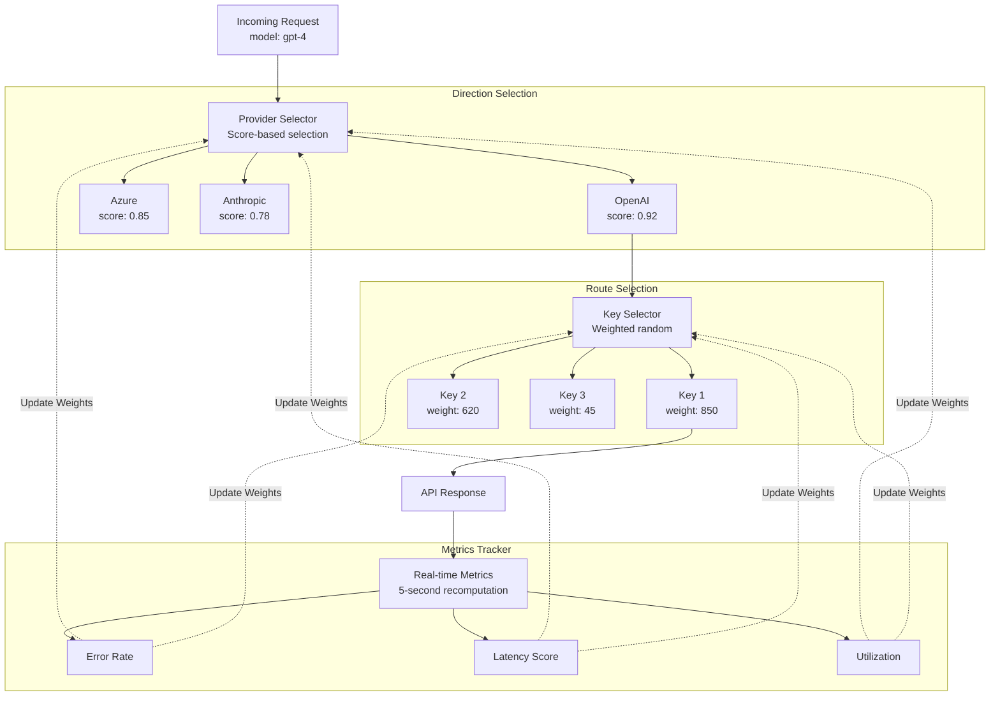
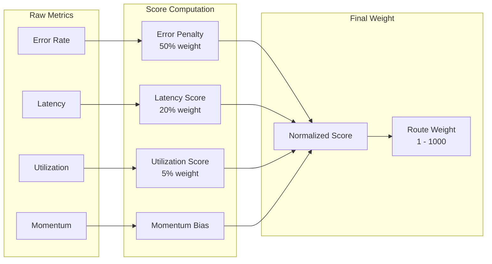

# Adaptive Load Balancing

> Advanced load balancing algorithms with predictive scaling, health monitoring, and performance optimization for enterprise-grade traffic distribution.

<Info>
  **Looking for comprehensive provider routing documentation?**

  For a detailed guide covering how adaptive load balancing works with governance routing, the two-level architecture (provider + key selection), Model Catalog integration, and example scenarios, see the [**Provider Routing Guide**](/providers/provider-routing).

  This page focuses on the technical implementation and performance characteristics of adaptive load balancing.
</Info>

## Overview

**Adaptive Load Balancing** in Bifrost Enterprise automatically optimizes traffic distribution across providers and keys based on real-time performance metrics. The system operates at **two levels** - provider selection (direction) and key selection (route) - continuously monitoring error rates, latency, and throughput to dynamically adjust weights, ensuring optimal performance and reliability.

### Key Features

| Feature                              | Description                                                                    |
| ------------------------------------ | ------------------------------------------------------------------------------ |
| **Dynamic Weight Adjustment**        | Automatically adjusts key weights based on performance metrics                 |
| **Real-time Performance Monitoring** | Tracks error rates, latency, and success rates per model-key combination       |
| **Cross-Node Synchronization**       | Gossip protocol ensures consistent weight information across all cluster nodes |
| **Circuit Breaker Integration**      | Temporarily removes poorly performing keys from rotation                       |
| **Fast Recovery**                    | Momentum-based scoring helps routes recover quickly after transient failures   |

<Tip>
  **Zero-overhead design**: All route selection logic adds less than **10 microseconds** to hot path latency. Weight calculations happen asynchronously every 5 seconds, so request routing uses pre-computed weights with minimal overhead.
</Tip>

***

## Architecture

The load balancing system operates at two levels:

* **Direction-level** (provider + model): Decides which provider to use for a given model
* **Route-level** (provider + model + key): Decides which API key to use within a provider

This two-tier approach enables both macro-level provider selection and micro-level key optimization.

***

## How Weight Calculation Works

Every 5 seconds, the system recalculates weights for all routes based on four factors:

| Factor                | Weight   | Purpose                                         |
| --------------------- | -------- | ----------------------------------------------- |
| **Error Penalty**     | 50%      | Penalizes routes with high error rates          |
| **Latency Score**     | 20%      | Penalizes routes with abnormally slow responses |
| **Utilization Score** | 5%       | Prevents overloading high-performing routes     |
| **Momentum Bias**     | Additive | Rewards routes that are recovering well         |

The system combines these into a single score, then converts it to a weight between 1 and 1000. Lower penalties mean higher weights, which means more traffic.

$$
Score = (P_{error} \times 0.5) + (P_{latency} \times 0.2) + (P_{util} \times 0.05) - M_{momentum}
$$

$$
Weight = W_{min} + (1 - Score) \times (W_{max} - W_{min})
$$

***

## Key Capabilities

1. **Automatic Route Health Management**: Routes automatically transition between 4 states (Healthy, Degraded, Failed, Recovering) based on error rates and latency. No manual intervention required when a route fails or recovers.

2. **Fair Traffic Distribution**: The system prevents any single route from being overloaded while still favoring better performers. Low-weight routes always get minimum traffic to prove recovery.

3. **Real-time Dashboard**: Provides visibility into weight distribution, performance metrics (error rates, latency), state transitions, and actual vs expected traffic per route.

<Frame>
  
</Frame>

4. **Multi-Factor Scoring**: Routes are scored using 4 components - Error Penalty (50% weight, time-decayed), Latency Score (token-aware via MV-TACOS algorithm), Utilization Score (fair-share balancing), and Momentum (accelerates recovery after failures).

5. **Smart Key Selection**: Uses weighted random selection with jitter (5% band) and 25% exploration probability to probe potentially recovered routes, rather than always picking the best route.

6. **Performance Thresholds**: Specific triggers drive state transitions —> 2% error rate triggers Degraded, >5% error rate or TPM hit triggers Failed, \<2% error with 50%+ expected traffic triggers Healthy.

<Tip>
  The system is designed to be self-healing: it penalizes failing routes quickly, but also enables fast recovery (90% penalty reduction in 30 seconds) once issues are fixed.
</Tip>

***

## Next Steps

<Steps>
  <Step title="Enable Adaptive Load Balancing">
    Contact your Bifrost Enterprise representative to enable adaptive load balancing for your deployment
  </Step>

  <Step title="Monitor Weight Distribution">
    Use the dashboard to observe how weights adapt to real traffic patterns
  </Step>

  <Step title="Analyze Performance">
    Review route state transitions and weight adjustments to understand system behavior
  </Step>
</Steps>

---

> To find navigation and other pages in this documentation, fetch the llms.txt file at: https://docs.getbifrost.ai/llms.txt