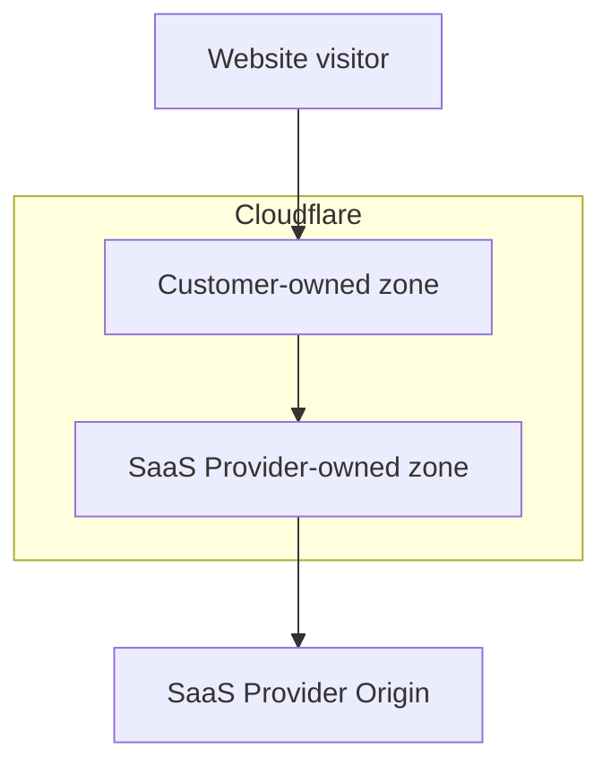
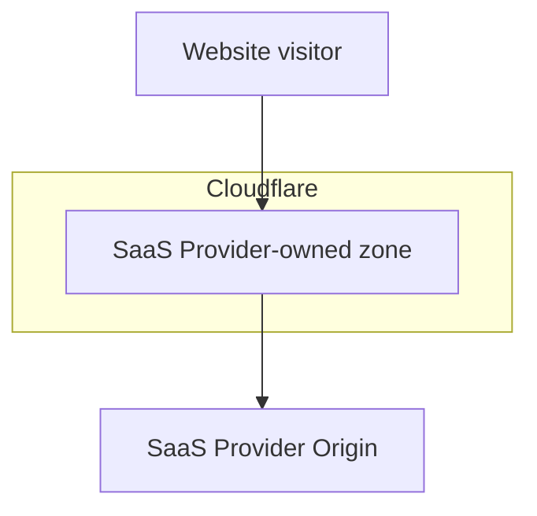

Orange-to-Orange (O2O) is a specific traffic routing configuration where traffic routes through two Cloudflare zones: the first Cloudflare zone is owned by customer 1 and the second Cloudflare zone is owned by customer 2, who is considered a SaaS provider.

If one or more hostnames are onboarded to a SaaS Provider that uses Cloudflare products as part of their platform - specifically the [Cloudflare for SaaS product](https://developers.cloudflare.com/cloudflare-for-platforms/cloudflare-for-saas/) - those hostnames will be created as [custom hostnames](https://developers.cloudflare.com/cloudflare-for-platforms/cloudflare-for-saas/domain-support/) in the SaaS Provider's zone.

To give the SaaS provider permission to route traffic through their zone, any custom hostname must be activated by you (the SaaS customer) by placing a [CNAME record](https://developers.cloudflare.com/cloudflare-for-platforms/cloudflare-for-saas/start/getting-started/#3-have-customer-create-cname-record) on your authoritative DNS. If your authoritative DNS is Cloudflare, you have the option to [proxy](https://developers.cloudflare.com/fundamentals/concepts/how-cloudflare-works/#application-services) your CNAME record, achieving an Orange-to-Orange setup.

## Prerequisites

* O2O only applies when the two zones are part of different Cloudflare accounts.
* Since O2O is based on CNAME, it does not apply when an A record is used to point to the SaaS provider's ([apex proxying](https://developers.cloudflare.com/cloudflare-for-platforms/cloudflare-for-saas/start/advanced-settings/apex-proxying/)).

## With O2O

If you have your own Cloudflare zone (`example.com`) and your zone contains a [proxied DNS record](https://developers.cloudflare.com/dns/proxy-status/) matching the custom hostname (`mystore.example.com`) with a **CNAME** target defined by the SaaS Provider, then O2O will be enabled.

DNS management for **example.com**

| **Type** | **Name** | **Target** | **Proxy status** |
| - | - | - | - |
| `CNAME` | `mystore` | `customers.saasprovider.com` | Proxied |

With O2O enabled, the settings configured in your Cloudflare zone will be applied to the traffic first, and then the settings configured in the SaaS provider's zone will be applied to the traffic second.

## Without O2O

If you do not have your own Cloudflare zone and have only onboarded one or more of your hostnames to a SaaS Provider, then O2O will not be enabled.

Without O2O enabled, the settings configured in the SaaS Provider's zone will be applied to the traffic.

