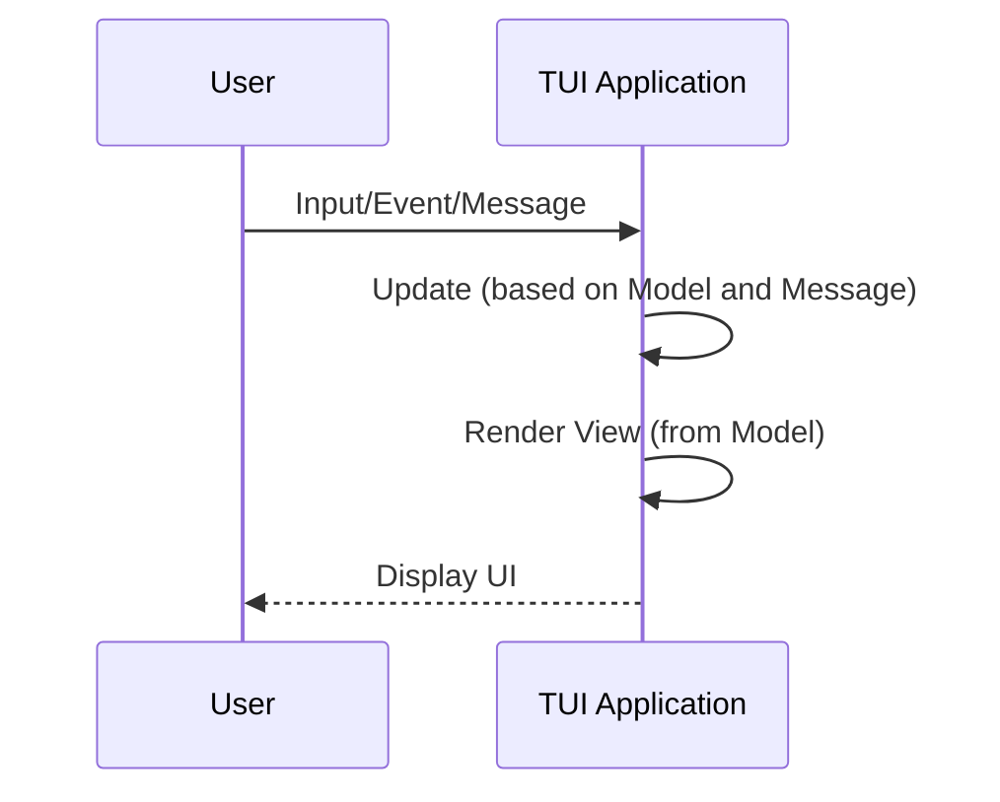

[ratatui.rs](https://ratatui.rs) is built with [`Astro`](https://astro.build/) and [`Starlight`](https://starlight.astro.build).

The source is available from the [ratatui/ratatui-website](https://github.com/ratatui/ratatui-website) GitHub repository.

If you would like to contribute, you can make a fork and clone the repository. Make sure you run the following [`git lfs`](https://ratatui.rs/developer-guide/git-guide/) commands before making a PR.

```

gitlfsinstall
gitlfspull
```

To build and run the site locally:

Feel free to make contributions and submit a PR if you’d like to improve the documentation.

- Prefer links from the root rather than using multiple levels of parent links. (e.g. `/concepts/backends/comparison/` instead of `../../backends/comparison/`).
- Prefer to add the last slash on links

## Astro and Starlight features

[Section titled “Astro and Starlight features”](#astro-and-starlight-features)

Starlight supports the full range of Markdown syntax in `.md` files as well as meta information for titles and descriptions in YAML frontmatter.

See [starlight](https://starlight.astro.build/guides/authoring-content/) for more information on how to author content in markdown.

## Custom components

[Section titled “Custom components”](#custom-components)

The website uses custom components and features to make it easier to generate high quality documentation that is more maintainable.

Use the `LinkBadge` component:

```

import LinkBadge from "/src/components/LinkBadge.astro";
<LinkBadgetext="default"href=""variant="default" />
<LinkBadgetext="outline"href=""variant="outline" />
<LinkBadgetext="note"href=""variant="note" />
<LinkBadgetext="danger"href=""variant="danger" />
<LinkBadgetext="success"href=""variant="success" />
<LinkBadgetext="caution"href=""variant="caution" />
<LinkBadgetext="tip"href=""variant="tip" />
```

This renders as:

[default]() [outline]() [note]() [danger]() [success]() [caution]() [tip]()

Use the `remark-include-code` plugin to include code from a test file:

````

```rust
{{#include@code/tutorials/hello-ratatui/src/main.rs}}
```
````

This renders as:

```

use ratatui::{DefaultTerminal, Frame};
fnmain() -> color_eyre::Result<()> {
color_eyre::install()?;
ratatui::run(app)?;
Ok(())
}
fnapp(terminal:&mut DefaultTerminal) -> std::io::Result<()> {
loop {
terminal.draw(render)?;
if crossterm::event::read()?.is_key_press() {
break Ok(());
}
}
}
fnrender(frame:&mut Frame) {
frame.render_widget("hello world", frame.area());
}
```

Draw diagrams with [`svgbob`](https://github.com/ivanceras/svgbob):

````

```svgbob
,-------------.
|Get Key Event|
`-----+-------'
|
|
,-----v------.
|Update State|
`-----+------'
|
|
,---v----.
| Render |
`--------'
```
````

This renders as:

Get Key Event Update State Render

Draw diagrams with [`mermaidjs`](https://mermaid.js.org/):

````


````

This renders as:

TUI ApplicationUserTUI ApplicationUserInput/Event/MessageUpdate (based on Model and Message)Render View (from Model)Display UI